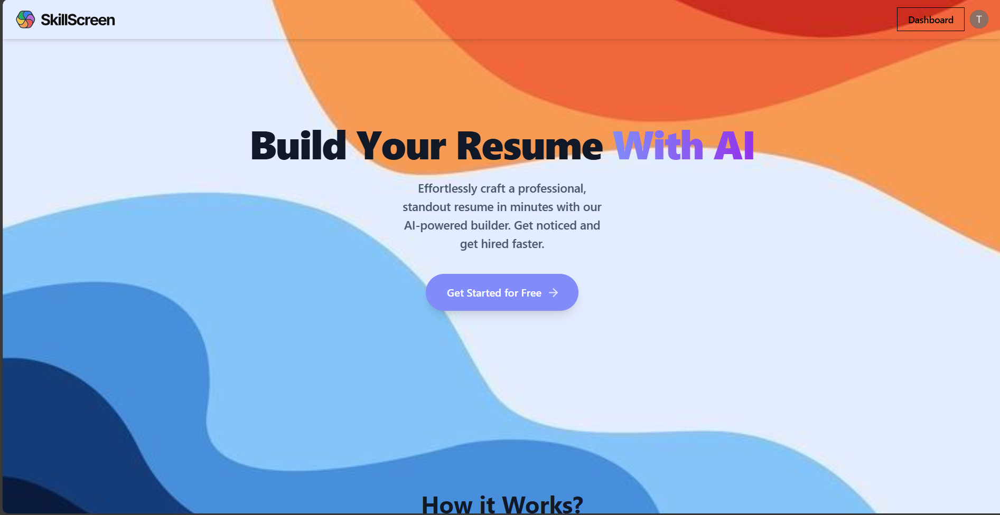

# 🚀 SkillScreen

A professional AI-powered resume builder that helps users generate job-ready resumes in minutes. SkillScreen uses advanced AI to craft perfect summaries and bullet points, tailored to your career goals.

## ✨ Features

* **AI-Powered Content:** Generates professional summaries and bullet points using Gemini AI.
* **Live Preview:** See your resume changes in real-time.
* **Download as PDF:** Export your finished resume instantly.
* **Authentication:** Secure login and registration via Clerk.
* **Database:** Persistent storage for user profiles and resumes using PostgreSQL (Neon).
* **Admin Dashboard:** Managed via Strapi CMS.

## 🛠️ Tech Stack

* **Frontend:** React.js, Vite, Tailwind CSS
* **Backend:** Strapi CMS (Headless Node.js CMS)
* **Database:** PostgreSQL (via Neon/Vercel)
* **AI Integration:** Google Gemini API
* **Authentication:** Clerk
* **Deployment:** Vercel (Frontend) & Render (Backend)

## 🚀 How to Run Locally

1.  **Clone the repository:**
    ```bash
    git clone [https://github.com/sahil2345ps-lab/ai-resume-builder.git](https://github.com/sahil2345ps-lab/ai-resume-builder.git)
    ```

2.  **Install Frontend Dependencies:**
    ```bash
    cd ai-resume-builder
    npm install
    npm run dev
    ```

3.  **Setup Environment Variables:**
    Create a `.env` file and add your keys:
    ```env
    VITE_STRAPI_API_KEY=your_api_key
    VITE_STRAPI_URL=http://localhost:1337
    ```

## 📸 Screenshots


---
